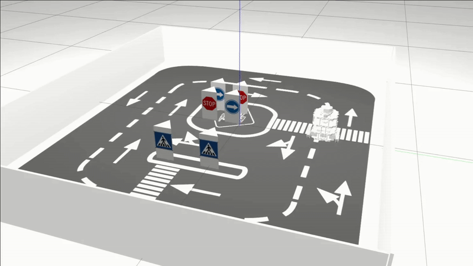

# Robot Wall Following

This project features a robot that autonomously finds a wall, positions itself parallel to it, and completes a specified number of laps around the track.



*[Watch full video](./README_FOLDER/robot_moving.mp4)*

## Technical Information

- **Service**: Used to locate the wall and position the robot parallel to it.
- **Main subscriber/publisher**: Records wall position data and controls robot movement.  
- **Action server**: Monitors robot odometry and signals the program to finish when the specified number of laps have completed

## System Requirements
- **Ubuntu**: 20.04
- **C++**: v17
- **ROS**: Foxy
- **Gazebo**

## Installation and Setup

### 1. Clone the Repository
```bash
git clone https://github.com/Joel-Milla/follow-wall-robot.git
```

### 2. Install Foxy
https://docs.ros.org/en/foxy/Installation/Ubuntu-Install-Debians.html

### 3. Install Dependencies
```bash
# Install Gazebo
curl -sSL http://get.gazebosim.org | sh

# Install ROS Gazebo packages
sudo apt install ros-foxy-gazebo-ros-pkgs ros-foxy-gazebo-ros2-control

# Install Dynamixel SDK
sudo apt install ros-foxy-dynamixel-sdk
```

### 4. Running the Program
```bash
# 1. Navigate to the root directory and execute:
./start_simulator.bash
# 2. Launch the Program
ros2 launch follow_wall nodes.launch.py
```
